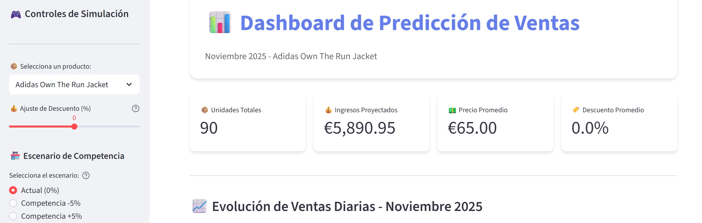
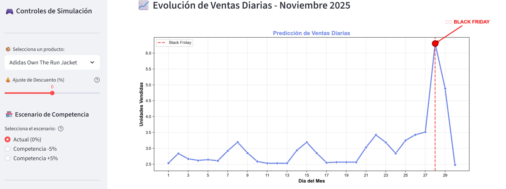
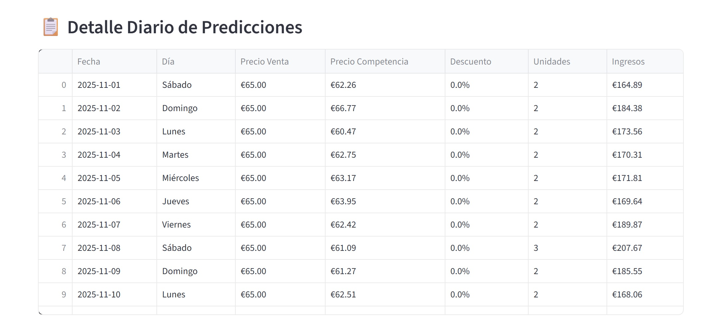

# Retail Forecasting: Prediccion de Ventas con Machine Learning

Sistema integral de prediccion de ventas para retail deportivo, basado en un modelo de Machine Learning (`HistGradientBoostingRegressor`) entrenado con datos historicos de ventas (2021-2024). El proyecto incluye un pipeline completo de procesamiento de datos, entrenamiento del modelo, generacion de predicciones y una aplicacion web interactiva desarrollada con Streamlit para la simulacion de escenarios comerciales en noviembre de 2025.

---

## Tabla de Contenidos

1. [Descripcion del Proyecto](#descripcion-del-proyecto)
2. [Estructura del Repositorio](#estructura-del-repositorio)
3. [Datos](#datos)
4. [Pipeline de Trabajo](#pipeline-de-trabajo)
5. [Modelo](#modelo)
6. [Aplicacion Web](#aplicacion-web)
7. [Instalacion y Ejecucion](#instalacion-y-ejecucion)
8. [Tecnologias Utilizadas](#tecnologias-utilizadas)

---

## Descripcion del Proyecto

El objetivo de este proyecto es predecir las unidades vendidas diarias de un catalogo de 24 productos deportivos durante noviembre de 2025. El sistema permite a los equipos comerciales simular diferentes escenarios de precios y competencia para optimizar su estrategia de ventas, con especial atencion a eventos clave como Black Friday y Cyber Monday.

El flujo de trabajo abarca las siguientes etapas:

- **Analisis exploratorio de datos (EDA):** Estudio de patrones temporales, estacionalidad, comportamiento por categoria/subcategoria y comparacion con precios de la competencia (Amazon, Decathlon, Deporvillage).
- **Ingenieria de features:** Creacion de variables temporales (dia de la semana, festivos, Black Friday, Cyber Monday), variables de lag (1-7 dias), media movil de 7 dias, ratio de precios frente a la competencia, descuento porcentual y codificacion one-hot de variables categoricas.
- **Entrenamiento y validacion del modelo:** Entrenamiento con datos de 2021-2023, validacion sobre noviembre 2024, analisis de degradacion del error por periodos y evaluacion especifica en Black Friday.
- **Modelo final:** Reentrenamiento con la totalidad de los datos historicos (2021-2024) y exportacion del modelo serializado.
- **Preparacion de datos de inferencia:** Transformacion del dataset de noviembre 2025 replicando las mismas operaciones de ingenieria de features.
- **Aplicacion web interactiva:** Dashboard en Streamlit que permite seleccionar productos, ajustar descuentos, simular escenarios de precios de competencia y visualizar predicciones diarias con indicadores clave de rendimiento (KPIs).

---

## Estructura del Repositorio

```
retail_forecasting/
|
|-- app/
|   |-- app.py                          # Aplicacion Streamlit (dashboard interactivo)
|
|-- data/
|   |-- raw/
|   |   |-- Entrenamiento/
|   |   |   |-- ventas.csv              # Datos historicos de ventas (2021-2024)
|   |   |   |-- competencia.csv         # Precios de competidores (Amazon, Decathlon, Deporvillage)
|   |   |-- Inferencia/
|   |       |-- ventas_2025_inferencia.csv  # Datos base para prediccion noviembre 2025
|   |-- processed/
|       |-- df.csv                      # Dataset de entrenamiento procesado
|       |-- inferencia_df_transformado.csv  # Dataset de inferencia transformado
|
|-- img/
|   |-- App_1.jpg                       # Captura: interfaz principal de la aplicacion
|   |-- App_2.jpg                       # Captura: grafica de prediccion del modelo
|   |-- App_3.jpg                       # Captura: tabla de predicciones diarias
|
|-- models/
|   |-- model_final.joblib              # Modelo entrenado serializado
|
|-- notebooks/
|   |-- entrenamiento.ipynb             # Notebook de EDA, feature engineering y entrenamiento
|   |-- forecasting.ipynb               # Notebook de preparacion de datos de inferencia
|
|-- requirements.txt                    # Dependencias del proyecto
```

---

## Datos

### Datos de Entrenamiento

- **ventas.csv:** Registro diario de ventas por producto (2021-2024). Incluye campos como `fecha`, `producto_id`, `nombre`, `categoria`, `subcategoria`, `precio_base`, `es_estrella`, `unidades_vendidas`, `precio_venta` e `ingresos`.
- **competencia.csv:** Precios diarios de los mismos productos en tres competidores: Amazon, Decathlon y Deporvillage.

### Datos de Inferencia

- **ventas_2025_inferencia.csv:** Datos base para noviembre de 2025, que incluyen los registros de octubre (necesarios para calcular los lags iniciales) y noviembre con las ventas a predecir.

### Datos Procesados

- **df.csv:** Dataset resultante tras la union de ventas y competencia, creacion de features temporales, lags, variables de precios y codificacion one-hot. Listo para entrenamiento.
- **inferencia_df_transformado.csv:** Dataset de inferencia con todas las transformaciones aplicadas, filtrado exclusivamente a noviembre de 2025 y preparado para la prediccion con el modelo.

### Catalogo de Productos (24 productos)

El catalogo abarca cuatro categorias principales:

| Categoria | Subcategorias |
|-----------|--------------|
| Running   | Zapatillas Running, Zapatillas Trail, Ropa Running |
| Fitness   | Mancuernas Ajustables, Pesas Casa, Pesa Rusa, Banco Gimnasio, Bandas Elasticas, Esterilla Fitness |
| Wellness  | Esterilla Yoga, Bloque Yoga, Cojin Yoga, Rodillera Yoga |
| Outdoor   | Mochila Trekking, Ropa Montana, Bicicleta Montana |

---

## Pipeline de Trabajo

### 1. Analisis Exploratorio y Calidad de Datos (`entrenamiento.ipynb`)

- Validacion de calidad de datos: tipos, nulos, duplicados y estadisticas descriptivas para ambos datasets.
- Union de datasets de ventas y competencia mediante merge por `fecha` y `producto_id`.
- Visualizaciones: evolucion temporal de ventas por ano, ventas por dia de la semana, por categoria, por subcategoria, top 15 productos y comparacion de densidad de precios frente a Amazon.

### 2. Ingenieria de Features (`entrenamiento.ipynb`)

Se generan las siguientes familias de variables:

- **Temporales y de calendario:** ano, mes, dia del mes, dia de la semana, fin de semana, festivos (libreria `holidays` para Espana), Black Friday, Cyber Monday, semana del ano, inicio/fin de mes, trimestre, dias hasta el proximo festivo, vispera de festivo, mitad de mes.
- **Lags y media movil:** Variables lag de 1 a 7 dias y media movil de 7 dias, calculadas por producto y ano para evitar data leakage.
- **Precios y competencia:** Descuento porcentual respecto al precio base, precio promedio de la competencia y ratio de precio propio frente a la competencia.
- **Encoding categorico:** One-Hot Encoding de las variables `nombre`, `categoria` y `subcategoria`.

### 3. Entrenamiento y Validacion (`entrenamiento.ipynb`)

- **Division temporal:** Entrenamiento con datos de 2021-2023, validacion con datos de 2024.
- **Algoritmo:** `HistGradientBoostingRegressor` de scikit-learn con parametros conservadores para evitar sobreajuste:
  - `learning_rate=0.03`
  - `max_iter=400`
  - `max_depth=7`
  - `l2_regularization=1.0`
  - `early_stopping=True`
- **Metricas:** MAE, RMSE, MAPE y R2, comparadas contra un baseline naive (media del entrenamiento).
- **Validacion en noviembre 2024:** Predicciones por producto estrella, MAE por producto, analisis de degradacion del error por periodos del mes (1-10, 11-20, 21-30) y evaluacion especifica en Black Friday 2024.

### 4. Modelo Final (`entrenamiento.ipynb`)

- Reentrenamiento con todos los datos historicos disponibles (2021-2024).
- Calculo de importancia de variables por permutacion.
- Serializacion del modelo con `joblib` en `models/model_final.joblib`.

### 5. Preparacion de Datos de Inferencia (`forecasting.ipynb`)

- Replica exacta de todas las transformaciones realizadas en el notebook de entrenamiento sobre el dataset de noviembre 2025.
- Relleno de valores nulos en lags con 0 (dado que los primeros dias del mes no tienen historial completo).
- Filtrado exclusivo de registros de noviembre (se descartan los de octubre, utilizados solo para generar lags).
- Exportacion del dataset transformado a `data/processed/inferencia_df_transformado.csv`.

---

## Modelo

**Algoritmo:** `HistGradientBoostingRegressor` (scikit-learn)

Este algoritmo fue seleccionado por su capacidad para manejar eficientemente datasets con variables numericas y categoricas codificadas, su soporte nativo para early stopping, su resistencia al sobreajuste mediante regularizacion L2 y su buen rendimiento en problemas de regresion con series temporales enriquecidas con features.

**Estrategia de prediccion recursiva:** En la aplicacion web, las predicciones se generan dia a dia de forma secuencial. Despues de predecir las unidades vendidas de un dia, se actualizan los lags y la media movil para el dia siguiente, lo que permite capturar la dinamica temporal de las ventas de forma realista.

---

## Aplicacion Web

La aplicacion web, desarrollada con **Streamlit**, funciona como un simulador interactivo de ventas. Permite a los usuarios explorar escenarios de precios y competencia para cualquiera de los 24 productos del catalogo.

### Funcionalidades principales

- Seleccion de producto del catalogo.
- Ajuste del descuento sobre el precio base (rango: -50% a +50%).
- Simulacion de tres escenarios de precios de competencia: actual, competencia -5% y competencia +5%.
- Visualizacion de KPIs: unidades totales, ingresos proyectados, precio promedio y descuento promedio.
- Grafica de evolucion diaria de ventas con identificacion de Black Friday.
- Tabla detallada con predicciones para cada dia del mes.
- Comparativa automatica de escenarios de competencia.

### Capturas de Pantalla

**Interfaz principal de la aplicacion**



La pantalla principal muestra el panel de control lateral con los selectores de producto, descuento y escenario de competencia, junto con los KPIs destacados del mes.

---

**Grafica de prediccion del modelo**



Visualizacion de la evolucion diaria de unidades vendidas predichas a lo largo de noviembre de 2025, con el pico de Black Friday claramente identificado.

---

**Tabla de predicciones diarias**



Detalle dia a dia con fecha, dia de la semana, precio de venta, precio de la competencia, porcentaje de descuento, unidades predichas e ingresos estimados.

---

## Instalacion y Ejecucion

### Requisitos previos

- Python 3.9 o superior.

### Pasos de instalacion

1. Clonar el repositorio:

```bash
git clone https://github.com/<usuario>/retail_forecasting.git
cd retail_forecasting
```

2. Crear y activar un entorno virtual:

```bash
python -m venv .venv
# Windows
.venv\Scripts\activate
# Linux / macOS
source .venv/bin/activate
```

3. Instalar las dependencias:

```bash
pip install -r requirements.txt
```

### Ejecucion de los notebooks

Abrir los notebooks en Jupyter o VS Code y ejecutar las celdas en orden:

- `notebooks/entrenamiento.ipynb` -- Analisis, entrenamiento y exportacion del modelo.
- `notebooks/forecasting.ipynb` -- Preparacion del dataset de inferencia.

### Ejecucion de la aplicacion web

```bash
cd app
streamlit run app.py
```

La aplicacion se abrira en el navegador en `http://localhost:8501`.

---

## Tecnologias Utilizadas

| Tecnologia | Uso |
|------------|-----|
| Python | Lenguaje principal del proyecto |
| pandas | Manipulacion y transformacion de datos |
| NumPy | Operaciones numericas |
| scikit-learn | Modelado (`HistGradientBoostingRegressor`), metricas y permutation importance |
| matplotlib | Visualizaciones estaticas |
| seaborn | Visualizaciones estadisticas |
| Streamlit | Aplicacion web interactiva |
| holidays | Identificacion de festivos en Espana |
| joblib | Serializacion del modelo |
| Jupyter | Entorno de desarrollo interactivo para notebooks |
